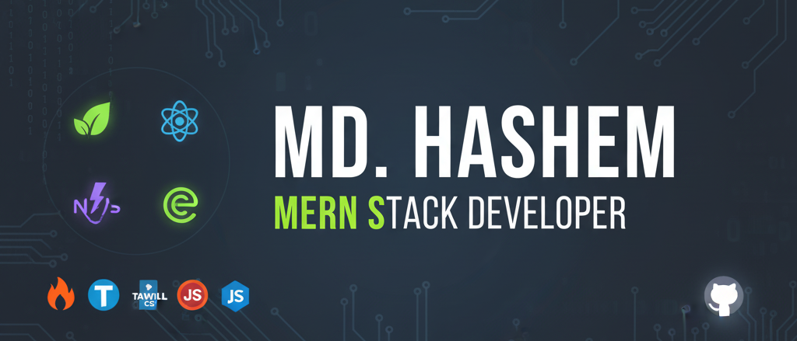

# Hi there! I'm Md. Hashem 👋

### MERN Stack Developer | Full-Stack Enthusiast

  

---

## 👨‍💻 About Me

I'm passionate MERN-stack developer focused on creating robust and user-friendly applications. Expertise includes front-end development with React & Bootstrap, and back-end logic with Node.js and MongoDB. Always integrating modern tools like Firebase for added functionality.

When I'm not coding, I enjoy **writing articles** and **sharing knowledge** within the developer community. Feel free to follow my journey!

## 🛠️ Skills Overview

Here are the technologies and tools I rely on to build modern web solutions:

| Category | Technologies |
| :--- | :--- |
| **Languages** |    |
| **Frontend** |    |
| **Back-End** |   |
| **Database** |   |
| **Tools & Platforms** |      |

## 📊 GitHub Performance Metrics

    <table>
        <tr>
            <td align="center">
                
            </td>
            <td align="center">
                
            </td>
        </tr>
        <tr>
            <td colspan="2" align="center">
                
            </td>
        </tr>
    </table>

###

## ✉️ Contact & Connect

Let's connect and discuss exciting opportunities, or just chat about development!

| Platform | Link/Address |
| :--- | :--- |
| **LinkedIn** | [Connect with me on LinkedIn] https://www.linkedin.com/in/md-hashem/ |
| **Email** | hashemm621@gmail.com |
| **Facebook** | [Find me on Facebook] https://www.facebook.com/hashem.hashem.56829 |

